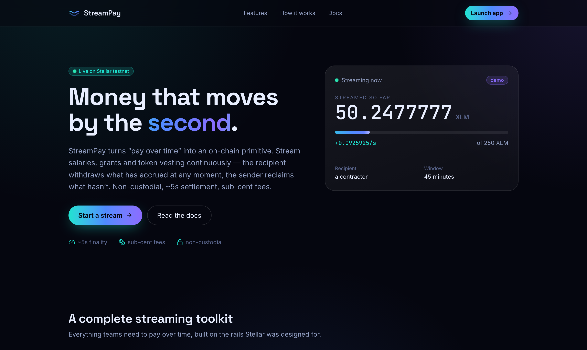
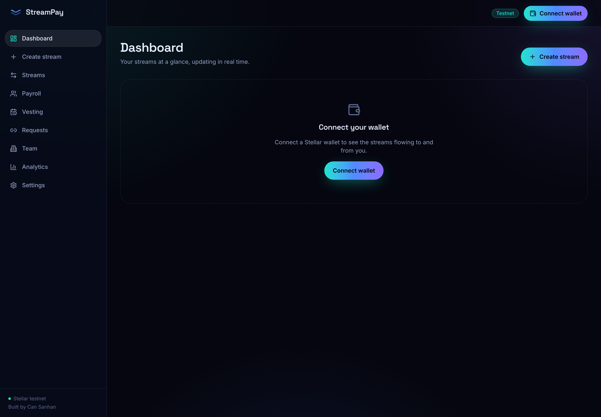
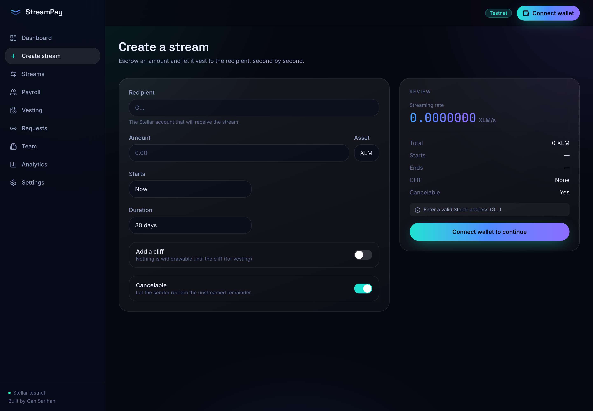
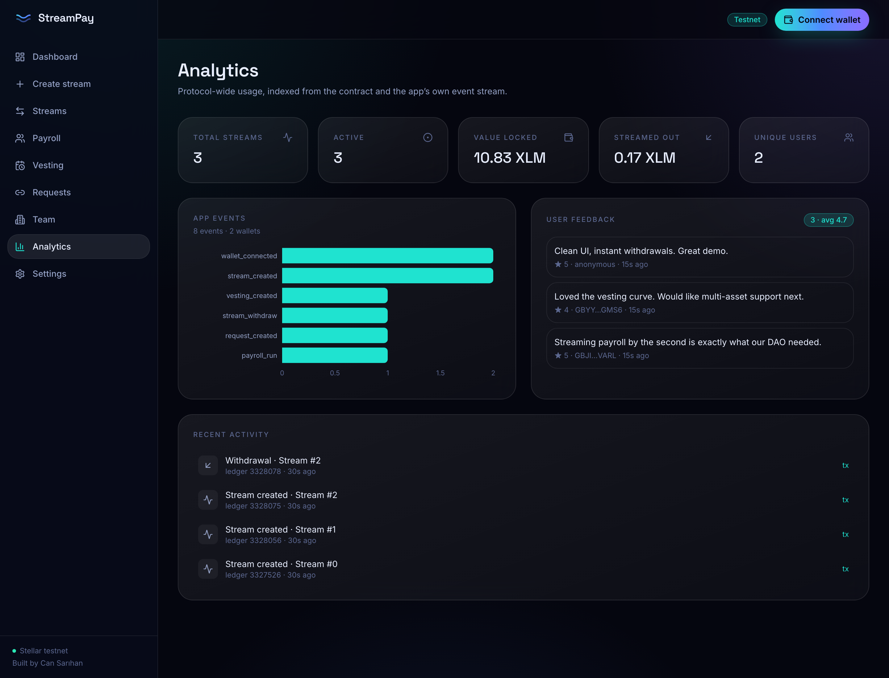
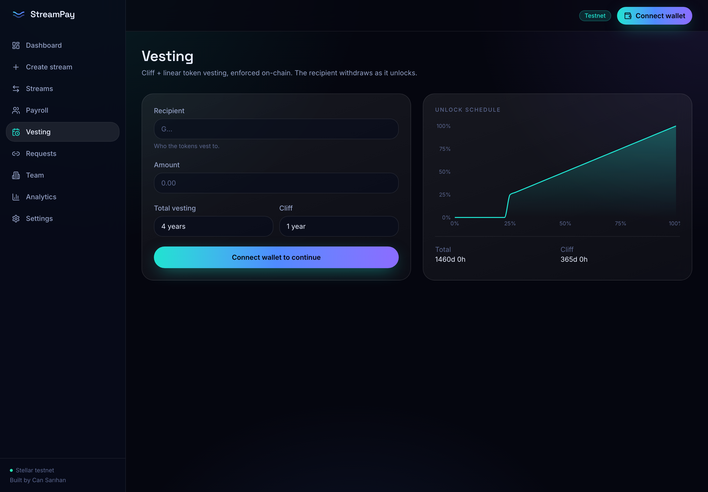
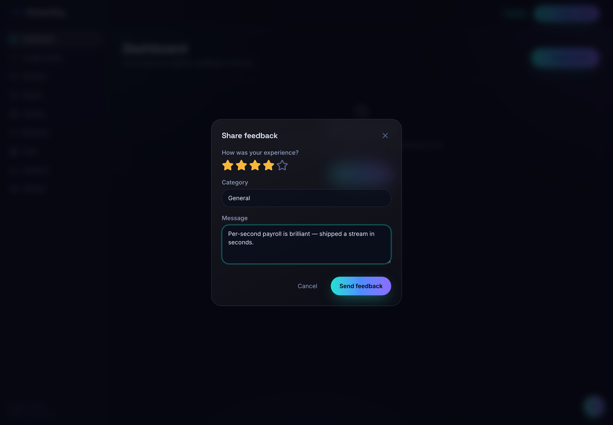
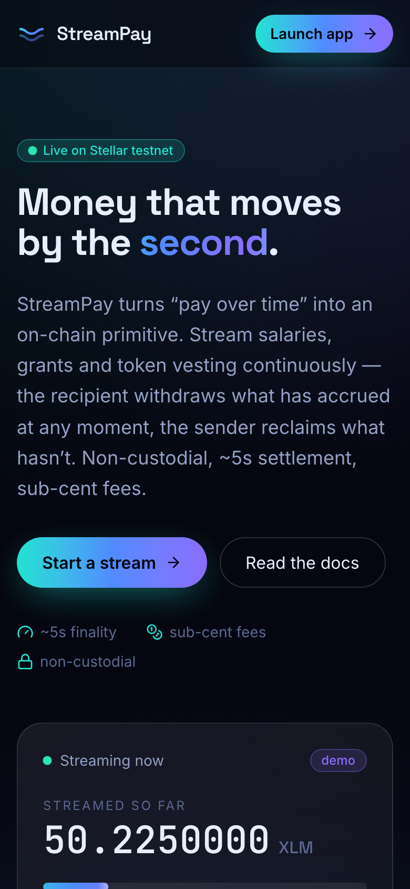
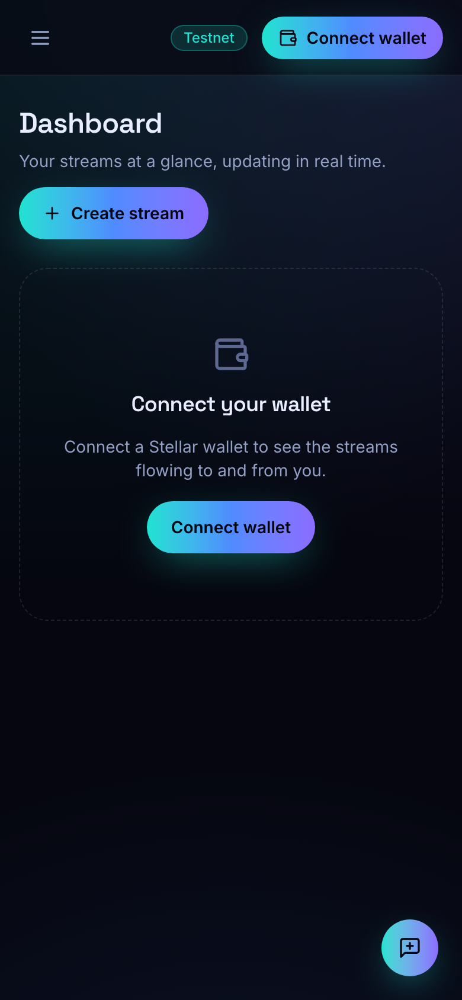

<div align="center">

# StreamPay

### Money that moves by the second — real-time payment streaming on Stellar

Pay salaries, grants, contractor invoices and token vesting **continuously** instead of in lump
sums. Funds vest per-second on-chain; the recipient withdraws what has accrued at any moment, and
the sender can cancel to reclaim whatever hasn't streamed — non-custodial, ~5s settlement, sub-cent
fees on Soroban.

[**Live demo**](https://cansarihan.github.io/streampay/) · [**Demo video**](#) · [**Contract on testnet**](https://stellar.expert/explorer/testnet/contract/CCFKV5HTRL33DCWURXES7IX6JR2MWSFW4LSC7UVTWONUPOGANAPETLHT) · Built by **Can Sarıhan**



</div>

---

## Why streaming, why Stellar

A salary is earned every second but paid once a month. A grant is delivered up front and trusted to
be spent over time. Vesting is tracked in spreadsheets. **StreamPay turns "pay over time" into a
first-class on-chain primitive:** lock an amount, set a start / cliff / end, and value flows
continuously to the recipient.

Stellar is the right base layer for it:

- **~5s finality & sub-cent fees** make per-second accounting and frequent withdrawals economical.
- **Soroban** gives the programmable escrow: linear + cliff vesting math, cancelation splits,
  protocol fees and events, all enforced on-chain.
- **Token-agnostic** — any Stellar Asset Contract (XLM, USDC, EURC, custom tokens) can be streamed.

## Features

| Capability | Description |
| --- | --- |
| **Linear streams** | Per-second release from `start` to `end`, withdrawable any time. |
| **Cliff vesting** | Nothing withdrawable until the cliff, then the accrued amount unlocks. |
| **Cancelable streams** | Sender reclaims the unstreamed remainder; recipient keeps what vested. |
| **Payroll batches** | Open many streams to many recipients in one flow (CSV import). |
| **Vesting schedules** | Cliff + linear curves for token/equity grants, with a visual schedule. |
| **Payment requests** | Request a stream via a shareable, self-contained public link. |
| **Teams / treasury** | Multi-member workspaces that run batch payroll from one place. |
| **Analytics & feedback** | Indexed activity, protocol stats, usage analytics and in-app feedback. |

## Screenshots

| Dashboard | Create a stream |
| --- | --- |
|  |  |

| Analytics & monitoring | Vesting schedule |
| --- | --- |
|  |  |

**In-app feedback widget**



**Mobile responsive**

<p align="center">
  
  &nbsp;&nbsp;
  
</p>

## Architecture

```
streampay/
├── contracts/streampay   Soroban (Rust) — streams, vesting math, withdraw/cancel, fees, events
├── packages/sdk          TypeScript SDK — typed contract client + stream math, shared by web & api
├── apps/api              Express + node:sqlite — Soroban event indexer, REST API, feedback, webhooks
└── apps/web              React + Vite + Tailwind — the "Liquid Flow" dashboard, widget & docs
```

**Data flow:** sender signs `create_stream` → the contract escrows funds & emits an event → the
indexer ingests it into the API → the dashboard shows the stream with a live per-second counter →
the recipient signs `withdraw` for the accrued amount. The contract is the source of truth — the web
app reads streams directly from it, with the API providing fast aggregates, activity and analytics.

See [`docs/ARCHITECTURE.md`](docs/ARCHITECTURE.md) for the deep dive.

## Quickstart

**Prerequisites:** Node ≥ 20, Rust + `wasm32v1-none` target, the [`stellar`](https://developers.stellar.org/docs/tools/cli) CLI, and a [Freighter](https://www.freighter.app/) wallet on testnet.

```bash
# 1. Install dependencies
npm install

# 2. Build & test the Soroban contract
npm run contract:test
npm run contract:build

# 3. Run the stack (in two terminals, or `npm run dev`)
npm run dev:api      # http://localhost:8787
npm run dev:web      # http://localhost:5173
```

Open the web app, connect Freighter (testnet), and create your first stream. Everything points at the
already-deployed testnet contract by default — no extra config needed.

## Contract interface

| Method | Who | Effect |
| --- | --- | --- |
| `create_stream(sender, recipient, token, deposit, start, cliff, end, cancelable)` | sender | Escrow `deposit`, open a stream, return its id |
| `withdraw(id, amount)` / `withdraw_max(id)` | recipient | Send the accrued amount (minus protocol fee) to the recipient |
| `cancel(id)` | sender | Pay out vested to recipient, refund the rest to sender |
| `streamed_amount(id)` / `withdrawable_amount(id)` | anyone | Read live vesting state |
| `get_streams_by_sender / by_recipient(addr)` | anyone | List a user's stream ids |
| `set_fee / set_admin / set_paused` | admin | Protocol governance |

The contract is covered by 10 unit tests (`contracts/streampay/src/test.rs`).

## SDK usage

```ts
import { StreamPayClient, parseUnits } from '@streampay/sdk';

const client = new StreamPayClient({
  contractId: 'CCFKV5HTRL33DCWURXES7IX6JR2MWSFW4LSC7UVTWONUPOGANAPETLHT',
  rpcUrl: 'https://soroban-testnet.stellar.org',
  networkPassphrase: 'Test SDF Network ; September 2015',
});

const stream = await client.getStream(0);                 // reads need no signer
const id = await client.createStream({ /* … */ }, signer); // writes take a wallet signer
```

## Deployment

- **Contract** — see live address below; redeploy with `stellar contract deploy` ([guide](docs/DEPLOYMENT.md)).
- **Web** — static SPA, deploy to Vercel (`vercel.json` included).
- **API** — container, deploy to Render / Railway / Fly (`apps/api/Dockerfile` + `render.yaml` included).

Full instructions and environment variables: [`docs/DEPLOYMENT.md`](docs/DEPLOYMENT.md).

### Deployment (Stellar testnet)

| | |
| --- | --- |
| **Contract ID** | [`CCFKV5HTRL33DCWURXES7IX6JR2MWSFW4LSC7UVTWONUPOGANAPETLHT`](https://stellar.expert/explorer/testnet/contract/CCFKV5HTRL33DCWURXES7IX6JR2MWSFW4LSC7UVTWONUPOGANAPETLHT) |
| **Network** | Test SDF Network ; September 2015 |
| **RPC** | `https://soroban-testnet.stellar.org` |
| **Streamable asset** | Native XLM (SAC `CDLZFC3S…CYSC`) — frictionless, every testnet account is funded |
| **Live web** | https://cansarihan.github.io/streampay/ (GitHub Pages) |
| **Live API** | https://streampay-api-jpfi.onrender.com (Render) |

Machine-readable addresses: [`deployments/testnet.json`](deployments/testnet.json).

## Verifying real usage (proof of wallet interactions)

Every stream is a real, signed transaction on Stellar testnet, so the proof is **on-chain and
public** — no need to trust the app:

- **On-chain (authoritative):** the contract's full transaction history is on
  [stellar.expert](https://stellar.expert/explorer/testnet/contract/CCFKV5HTRL33DCWURXES7IX6JR2MWSFW4LSC7UVTWONUPOGANAPETLHT)
  — every account that created or withdrew a stream appears there, with timestamps and amounts.
- **In the app (live):** the **Streams** page reads each user's streams straight from the contract;
  the **Analytics** page shows protocol-wide stats, a live activity feed (each row links to its tx)
  and the feedback summary — powered by the deployed API at
  [`streampay-api-jpfi.onrender.com`](https://streampay-api-jpfi.onrender.com/api/stats).
- **Contract views:** anyone can call `total_streams()` and `get_streams_by_sender/recipient(addr)`.

## Observability

- **Analytics** — every wallet interaction is recorded by the API and (optionally) PostHog; the
  Analytics page charts protocol stats, app events and a live on-chain activity feed.
- **Error tracking** — an `ErrorBoundary` reports to the API and (optionally) Sentry.
- **Feedback** — a built-in widget collects ratings + messages, summarized on the Analytics page.

PostHog and Sentry are env-gated (`VITE_POSTHOG_KEY`, `VITE_SENTRY_DSN`) and load only when set.

## Roadmap

- **Now (Level 4):** testnet MVP — streams, payroll, vesting, requests, teams, analytics, feedback.
- **Next:** multi-asset (USDC/EURC) with a test-token faucet; a native batch-create contract method.
- **Later:** mainnet, embeddable checkout widget, recurring/top-up streams, anchor fiat off-ramp.

## Level 4 (Green Belt) checklist

- ✅ Production-ready MVP, stable contract + frontend architecture, mobile responsive, loading/error states
- ✅ Smart contract on Stellar testnet (+ 10 unit tests, optimized wasm)
- ✅ Monitoring & analytics + in-app feedback collection
- ✅ Public repo, README, 15+ meaningful commits, demo video & live link, screenshots, contract address

## License

MIT © Can Sarıhan
